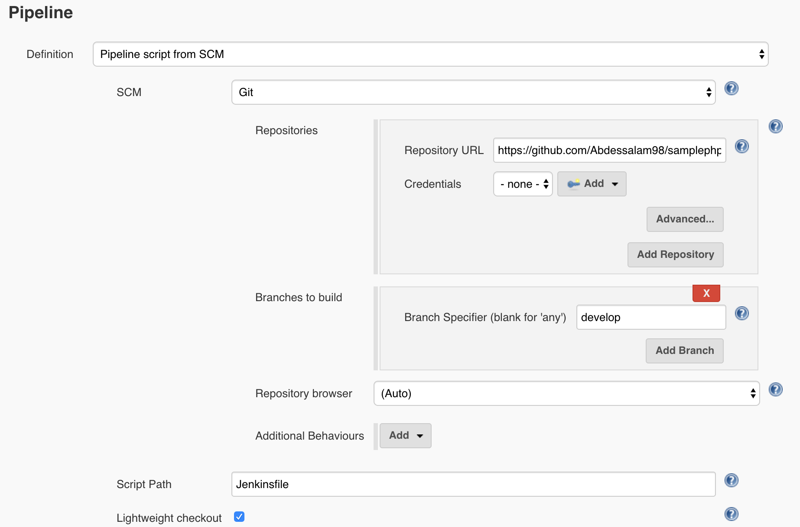
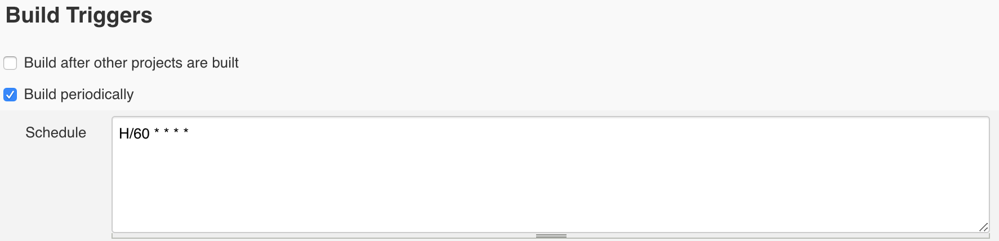
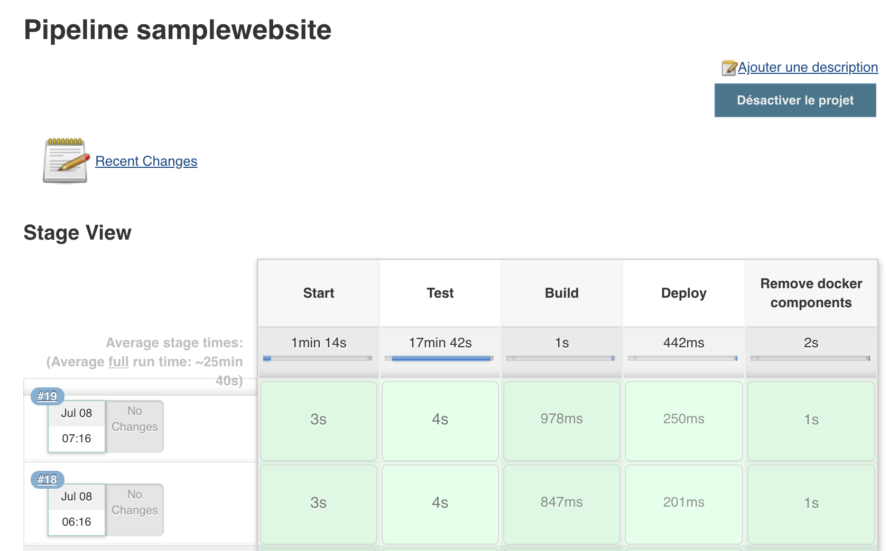

# DevOps Docker PHP Nginx

## 📦 Requirements

This project should be working as expected with the following minimal version of:

| Requirement | Version |
| ----------- | :-----: |
| PHP         |  >=7.0  |
| PHPUnit     |  >=6.5  |
| Nginx       | >=1.10  |

### Suggested requirements

#### For Mac

- [Kitematic](https://kitematic.com/)

## 🔧 Useful links

- [Docker Engine](https://docs.docker.com/installation/)
- [Docker Compose](https://docs.docker.com/compose/)

## 🧐 What's inside?

```
.
├── app
|    ├── content
|    ├── template
|    ├── tests
|    ├── config.php
|    ├── functions.php
|    └── index.php
├── docker
|    ├── nginx
|    ├── jenkins
|    └── php
├── Jenkinsfile
├── .gitignore
├── docker-compose.yml
└── README.md
```


## 🚀 Quick start

1. **Clone the git repository**

```bash
# cloning git repository into `samplephpwebsite` folder
$ git clone https://github.com/Abdessalam98/samplephpwebsite samplephpwebsite
```

2. **Run containers**

Check that you have `./docker-compose.yml` or override it by creating a new one then run `docker-compose up -d`

```bash
# Now you can run all containers with detached mode based on docker-compose.yml
$ docker-compose up -d
```

3. **Start using the project**

> web server is running at http://localhost:8080

Open browser and see the rendered pages

You can use `start.sh`

```bash
chmod +x start.sh
./start.sh
```

## ✅ Testing app with PHPUnit

PHPUnit is already set. You can directly run tests inside the PHP container. All tests are in `./app/tests`

For this example we made a test class `SampleTest` that runs tests for site functions

```bash
$ docker-compose exec -T php phpunit tests/sampleTest.php
```

## 👷 CI with Jenkins

When you started containers, Jenkins was launched on a docker container running at http://localhost:8081. You can modify `./docker-compose.yml` if you want.

You can also remove it from `./docker-compose.yml` and run this command on your terminal. 


1. We need to run the Jenkins container with mounted docker daemon.

```bash
$ docker run --name jenkins-sample -d -v jenkins_home:/var/jenkins_home -v /var/run/docker.sock:/var/run/docker.sock -p 8081:8080 jenkins/jenkins:lts 
```

1. We should install docker in Jenkins container in order to use docker in our pipelines (Docker in Docker). Check required packages on [Jenkins Dockerfile](../docker/jenkins/Dockerfile)

2. Once Jenkins started, you can configure it at http://localhost:8081

3. Create a new job. When you configure the pipeline you have to specify the link of the git repo and the Jenkinsfile.

4. Run build job

**Pipeline:**



**Build triggers:**

You can also trigger a Jenkins build every time changes are pushed to a Git branch on GitHub using GitHub hooks. But in our case we trigger build periodically (each hour).



**Running builds**




## Author

[Abdessalam BENHARIRA](https://abdessalam-benharira.me)
